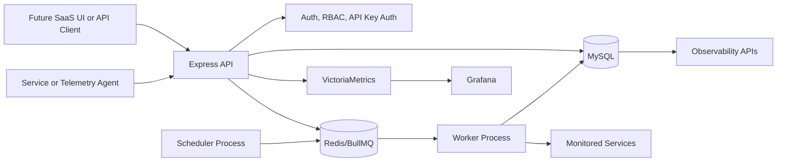
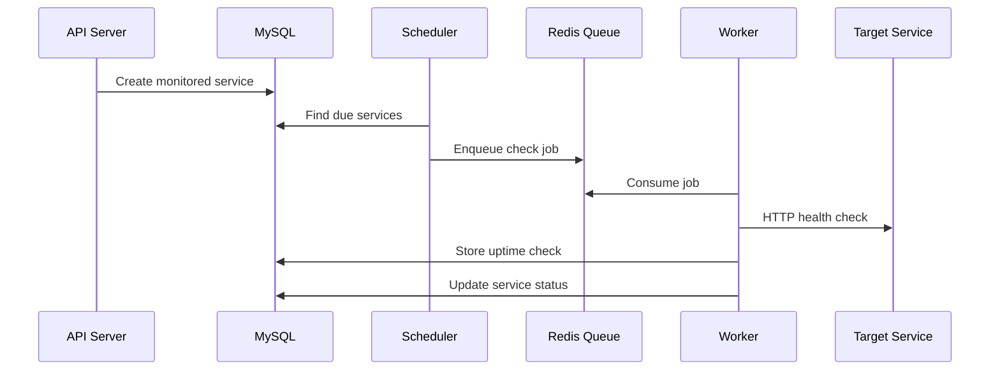
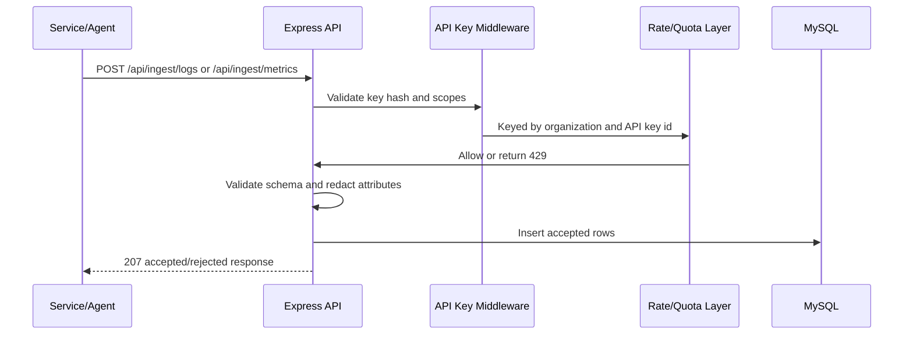
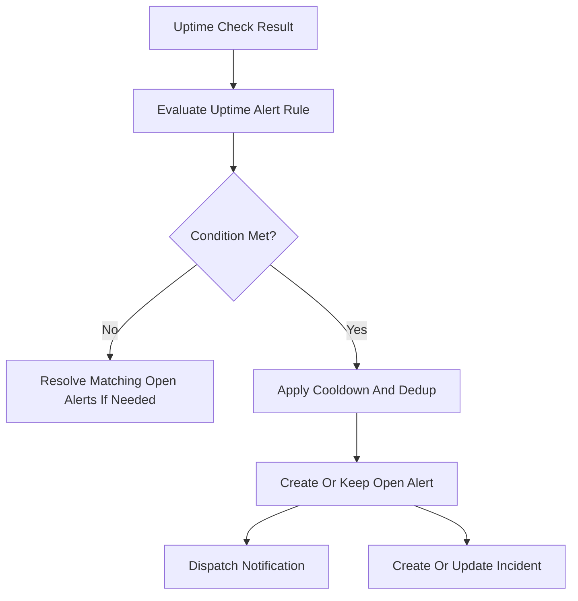
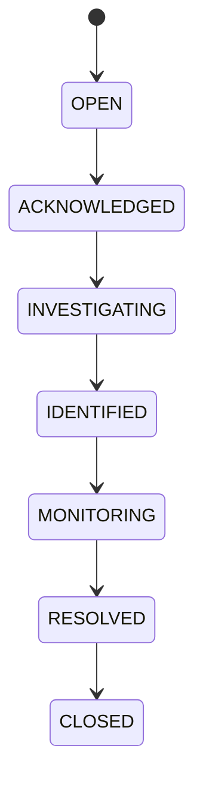

# Architecture

Sidroid is a production-style observability SaaS backend. It combines a SaaS control plane with monitoring data flows for uptime checks, logs, metrics, alerts, incidents, and dashboard APIs.

## High-Level View

The project is intentionally backend-first. It has enough production-grade foundation to discuss real SaaS architecture in interviews, while still keeping future features such as a full frontend, billing, and AI summaries out of scope.

## Control Plane Vs Data Plane

Control plane responsibilities:

- organizations and users
- organization memberships and RBAC
- API keys
- monitored service registry
- alert rules
- incidents and timelines
- audit logs
- dashboard summary APIs
- migration and deployment workflows

Data plane responsibilities:

- uptime check execution
- log ingestion
- metric ingestion
- raw metric storage in VictoriaMetrics for infrastructure metrics
- query and aggregation paths
- worker queue execution

This split keeps tenant-owned configuration separate from operational telemetry and background execution.

## Tenancy Model

The tenant boundary is `organizationId`.

Key rules:

- Users belong to a default organization and can have explicit organization memberships.
- Most tables carry `organizationId`.
- Protected APIs read the active organization from the authenticated JWT/membership.
- API-key ingestion uses the API key organization as the tenant source of truth.
- Clients do not get to choose `organizationId` for ingestion.
- Cross-tenant access returns not found or unauthorized responses instead of leaking existence.

Important tenant-scoped tables include:

- `users`
- `organization_members`
- `monitored_services`
- `uptime_checks`
- `api_keys`
- `alerts`
- `uptime_alert_rules`
- `incidents`
- `incident_events`
- `log_entries`
- `metric_samples`
- `audit_logs`

## Auth And RBAC Model

Authentication:

- JWT for user-facing routes.
- bcrypt for password hashing.
- API keys for telemetry ingestion.
- API key hashes are stored, not raw keys.
- Raw API key value is returned only once on creation.

Organization roles:

- `OWNER`
- `ADMIN`
- `DEVELOPER`
- `VIEWER`

Role usage:

- `VIEWER` can read dashboards, logs, metrics, services, alerts, and incidents.
- `DEVELOPER` can manage technical workflows such as services and incidents.
- `ADMIN` and `OWNER` can manage broader organization resources.

## Monitoring Flow

The API server does not automatically start the worker. API and worker are separate runtime concerns.

## Telemetry Ingestion Flow

Request-level safeguards:

- max raw batch size
- max accepted rows per request
- scoped API keys
- rate limiting
- service ownership validation
- sensitive attribute redaction

## Alert Evaluation Flow

Uptime alert rules are evaluated after uptime checks.

The system treats `DOWN` results as completed check outcomes, not failed queue jobs.

## Incident Lifecycle

Incident records store:

- title and description
- severity and status
- optional service and alert linkage
- assignment
- acknowledgement and resolution metadata
- postmortem fields
- timeline events

## Worker And Queue Architecture

Runtime processes:

- API server: Express routes, auth, dashboards, mutations.
- Worker with scheduler: scans due services and processes checks.
- Redis: queue backing store.
- MySQL: durable service, check, alert, incident, telemetry, and audit state.

Benefits:

- API request handling is separated from periodic work.
- Worker failures can be retried.
- Queue diagnostics can be exposed separately.
- Multiple workers can be added later.

Current limitation:

- There is no distributed leader election for schedulers yet. A production multi-replica deployment should ensure only one scheduler enqueues due checks, or use idempotent queue scheduling.

## Database Model Overview

Core model groups:

- SaaS: `Organization`, `User`, `OrganizationMember`, `AuditLog`
- Auth/API keys: `ApiKey`
- Monitoring: `MonitoredService`, `UptimeCheck`
- Alerts: `AlertRule`, `Alert`, `NotificationChannel`, `UptimeAlertRule`
- Incidents: `Incident`, `IncidentEvent`
- Telemetry: `LogEntry`, `MetricSample`
- AWS discovery: `AwsAccount`, `MonitoredInstance`, `SyncLog`

The schema is migration-managed through Prisma. Phase 9 added migration verification against disposable Docker MySQL.

## Docker And Compose Architecture

Compose services:

- `mysql`
- `redis`
- `victoriametrics`
- `vmagent`
- `grafana`
- `backend`
- `worker`

The backend and worker use the same Dockerfile. The worker overrides the command with `npm run worker`.

Important:

- Migrations are explicit and not run automatically on API startup.
- Compose is local/demo oriented, not a complete production orchestrator.
- MySQL host port is configurable through `MYSQL_HOST_PORT`.

## CI/CD Overview

GitHub Actions includes:

- dependency install
- lint
- unit tests
- Prisma validate
- Prisma generate
- Docker Compose config validation
- backend Docker build attempt
- MySQL integration tests in a separate job

CI does not require AWS credentials or production secrets.

## Security Design

Implemented:

- hashed passwords
- hashed API keys
- JWT auth
- organization membership checks
- role-based authorization
- tenant-scoped repositories/controllers
- telemetry redaction
- request body size limit
- rate limiting
- safe 429 responses
- no committed real secrets

Still needed before real production:

- managed secret store
- TLS/reverse proxy
- audit completion after local CA issues are fixed
- stronger operational monitoring
- backup and restore runbooks
- persistent quotas and billing enforcement

## Scalability Considerations

Current foundations:

- MySQL indexes for tenant/time-series query patterns.
- Cursor pagination for logs and metrics.
- Worker process separated from API.
- Redis-backed rate limiting option.
- Dockerized API/worker split.

Future scaling work:

- move high-volume telemetry to purpose-built stores
- forward custom metrics to VictoriaMetrics
- shard or partition telemetry tables
- add read replicas for dashboard queries
- add worker concurrency controls per tenant
- add durable usage counters and plan limits

## Limitations

- No full frontend yet.
- No AI summaries yet.
- No billing or per-plan usage model.
- No production IaC.
- Docker build fails in this local environment during container `npm ci`; `npm audit` separately fails with certificate verification.
- Compose is not a production deployment by itself.
